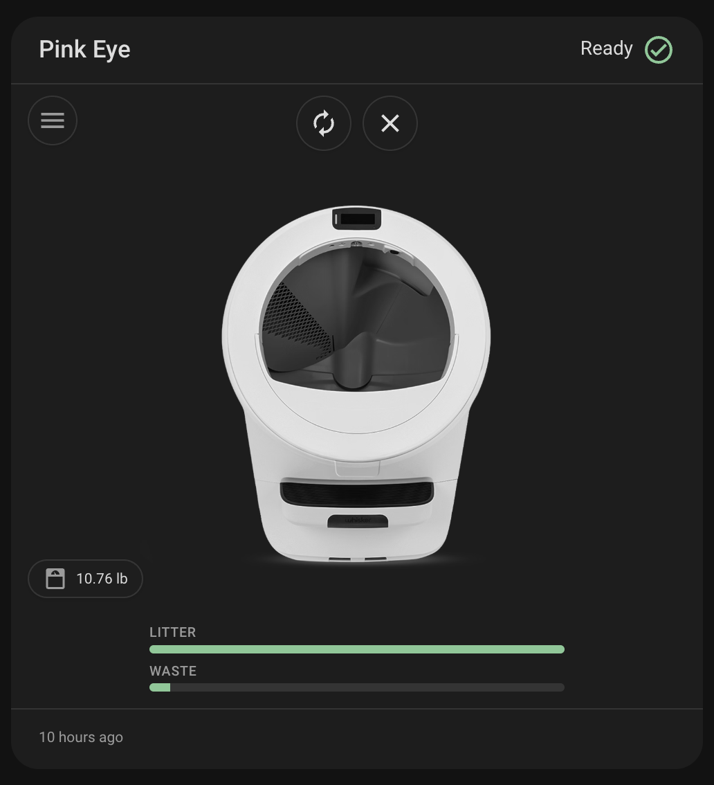
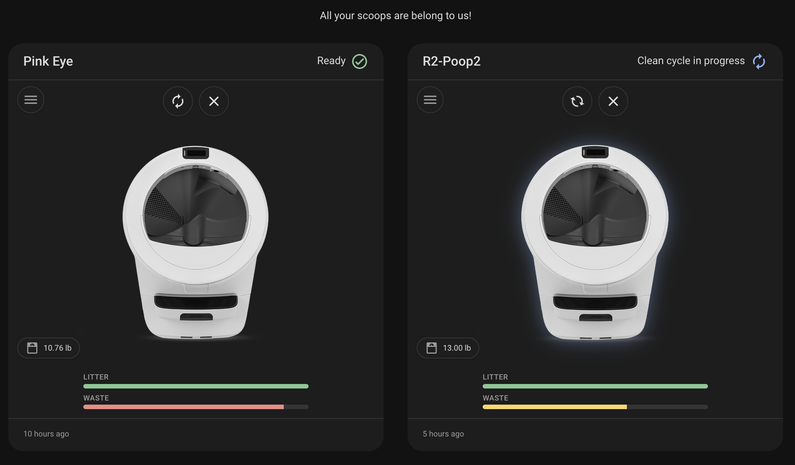
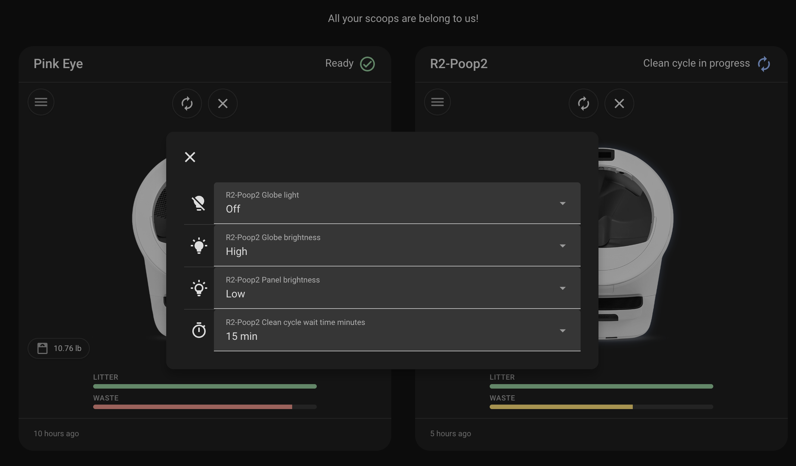
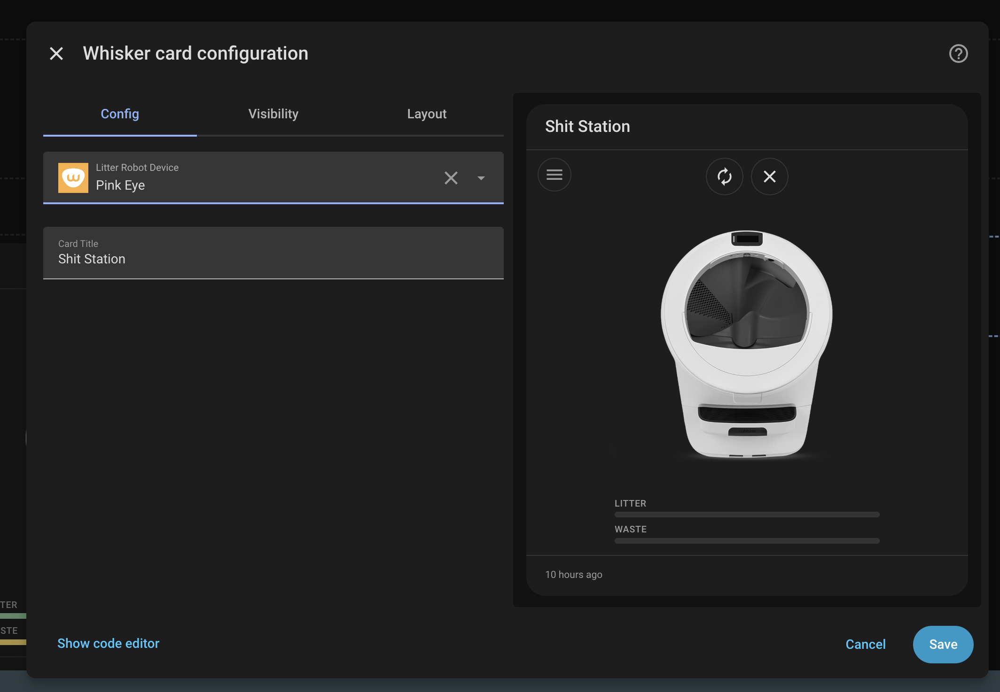

# Whisker Card

_Litter-Robot status and controls in a single Lovelace card_




[](https://github.com/hacs/integration)


## Overview

Whisker Card is a custom Lovelace card for Home Assistant that shows your **Litter-Robot** at a glance. It uses the official **[Litter-Robot integration](https://www.home-assistant.io/integrations/litterrobot/)** (`litterrobot`).



## Requirements

- Home Assistant with the **Litter-Robot** integration configured and at least one robot **device** present.
- The card is configured with a **`device_id`** (pick the robot in the visual editor, or paste the id from **Settings → Devices & services → Litter-Robot → device**).

## Compatibility and testing

The card has been **developed and tested with a Litter-Robot 5 Prop (LR5)**. Other models (for example LR3 or LR4) may work as long as the core integration exposes the same kinds of entities and translation keys; behavior can differ slightly (for example how **reset** is exposed). If something does not show up or act correctly on your model, **[open an issue](https://github.com/homeassistant-extras/whisker/issues)** so we can track it—include your HA version, integration version, and robot model when you can.

## Features

- **Status header** — Friendly title (device name or optional override), human-readable status text, and a colored **status icon** derived from the `status_code` sensor.
- **Cycle styling** — While the robot reports an active cycle (`ccp`, `ec`, `cst`), the card reflects **cycling** state for subtle visual emphasis.
- **Quick actions** — Picture-style controls for the litter box **vacuum** and **reset** (see [Interactions](#interactions) below).
- **Controls menu** — A menu button opens a dialog with standard Lovelace **entity rows** for globe light, globe brightness, panel brightness, and cycle delay when those entities exist.
- **Pet weight** — A compact chip for the **pet weight** sensor (when present).
- **Litter and waste gauges** — Visual fill levels; waste styling reflects severity as the drawer fills.
- **Last seen** — Shown at the bottom when a **last_seen** entity is available.

## Interactions

| Control                 | Tap / click                                   | Hold (press and hold)                                                  |
| ----------------------- | --------------------------------------------- | ---------------------------------------------------------------------- |
| **Litter box** (vacuum) | Starts a clean cycle (`vacuum.start`)         | Opens the standard Home Assistant **more-info** dialog for that entity |
| **Reset**               | Presses the reset **button** (`button.press`) | Opens **more-info** for that entity                                    |

The **controls menu** (hamburger icon) opens a dialog of full entity rows—use each row’s own tap/hold behavior as in the rest of Lovelace.



**Pet weight chip** and **litter / waste gauges**: **click** (or keyboard activate on the chip) opens **more-info** for the corresponding entity.

## Configuration

### Visual editor

Add the card from the dashboard editor and choose **Litter Robot Device** (filtered to the `litterrobot` integration). Optionally set **Card Title** to override the device name shown in the header.



### YAML

Minimal configuration:

```yaml
type: custom:whisker-card
device_id: YOUR_DEVICE_ID
```

With an optional title:

```yaml
type: custom:whisker-card
device_id: YOUR_DEVICE_ID
title: Cat HQ
```

| Option      | Type   | Description                                                        |
| ----------- | ------ | ------------------------------------------------------------------ |
| `device_id` | string | **Required.** Home Assistant device id for the Litter-Robot.       |
| `title`     | string | Optional. Overrides the card heading; defaults to the device name. |

## Quick start

```yaml
type: custom:whisker-card
device_id: YOUR_DEVICE_ID
```

Replace `YOUR_DEVICE_ID` with the id from the device page in Home Assistant, or use the UI editor to pick the device.

## Installation

### HACS (recommended)

[](https://my.home-assistant.io/redirect/hacs_repository/?owner=homeassistant-extras&repository=whisker&category=dashboard)

1. Open **HACS** in Home Assistant.
2. Open the menu → **Custom repositories**.
3. Add `https://github.com/homeassistant-extras/whisker` and category **Dashboard**.
4. Install **Whisker Card** (or the name shown for this repository) and restart if prompted.
5. Add the Lovelace resource if HACS does not do it automatically (see manual steps below for the exact URL pattern).

### Manual installation

1. Download **`whisker.js`** from the **`dist`** folder attached to the [latest release](https://github.com/homeassistant-extras/whisker/releases) (the build artifact is `dist/whisker.js`).
2. Copy it to `www/community/whisker/` (create the folder if needed).
3. Register the module under **Settings → Dashboards → Resources** (or in `configuration.yaml`):

```yaml
lovelace:
  resources:
    - url: /local/community/whisker/whisker.js
      type: module
```

## Development

Clone the repository, install dependencies with **yarn**, then **`yarn build`** produces `dist/whisker.js`. Unit tests use **Mocha**: run **`yarn test`**.

## Project Roadmap

- [x] **Litter-Robot device discovery** via `translation_key` mapping
- [x] **Visual card** — status, gauges, pet weight, last seen
- [x] **Tap / hold** actions on status icons (cycle / reset vs more-info)
- [x] **Controls dialog** with native entity rows
- [x] **Lovelace card editor** (device selector + title)
- [x] **Automated tests** (Mocha)

## Contributing

- [Join the Discussions](https://github.com/homeassistant-extras/whisker/discussions) — Share feedback or ask questions.
- [Report Issues](https://github.com/homeassistant-extras/whisker/issues) — Bugs, model-specific gaps, or feature requests ([issue templates](https://github.com/homeassistant-extras/whisker/tree/main/.github/ISSUE_TEMPLATE)).
- [Submit Pull Requests](https://github.com/homeassistant-extras/whisker/blob/main/CONTRIBUTING.md) — See contributing guidelines when available.
- [Discord](https://discord.gg/NpH4Pt8Jmr) — Extra help or chat.
- [More homeassistant-extras projects](https://github.com/orgs/homeassistant-extras/repositories)

## License

This project is licensed under the MIT License. See the [LICENSE](LICENSE) file.

## Acknowledgments

- Built with [Lit](https://lit.dev/).
- Status mapping aligns with Home Assistant’s `litterrobot` **status_code** sensor options.
- Thanks to all contributors!

[](https://github.com/homeassistant-extras/whisker/graphs/contributors)

[](https://ko-fi.com/N4N71AQZQG)
