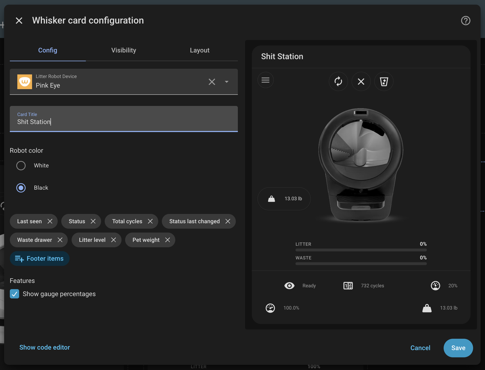
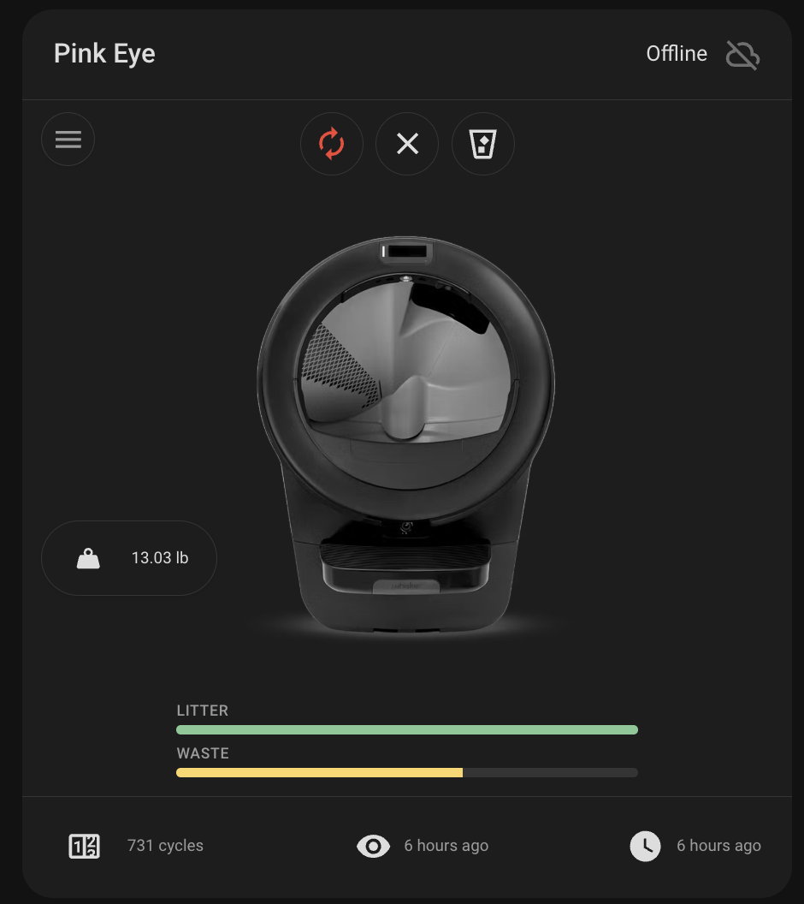

# Configuration guide

Configure Whisker Card from the dashboard visual editor or in YAML.

## Table of contents

- [Visual editor](#visual-editor)
- [YAML basics](#yaml-basics)
- [Configuration options](configuration/OPTIONS.md)
- [Interactions](configuration/INTERACTIONS.md)
- [Footer](configuration/FOOTER.md)
- [Feature flags](configuration/FEATURE-FLAGS.md)
- [Examples](configuration/EXAMPLES.md)

## Visual editor

Add the card from the dashboard editor and choose **Litter Robot Device** (filtered to the `litterrobot` integration). Optionally set **Card Title** to override the device name shown in the header, and **Robot color** to match your hardware. The robot model (Litter-Robot 4 / 5 / 5 Pro / Evo) is detected automatically from the device; only the color (white or black) is a manual choice.



## YAML basics

Minimal configuration:

```yaml
type: custom:whisker-card
device_id: YOUR_DEVICE_ID
```

With an optional title:

```yaml
type: custom:whisker-card
device_id: YOUR_DEVICE_ID
title: Cat HQ
```

With a black robot (model auto-detected):

```yaml
type: custom:whisker-card
device_id: YOUR_DEVICE_ID
color: black
```



See [Examples](configuration/EXAMPLES.md) for footer and feature-flag YAML.
