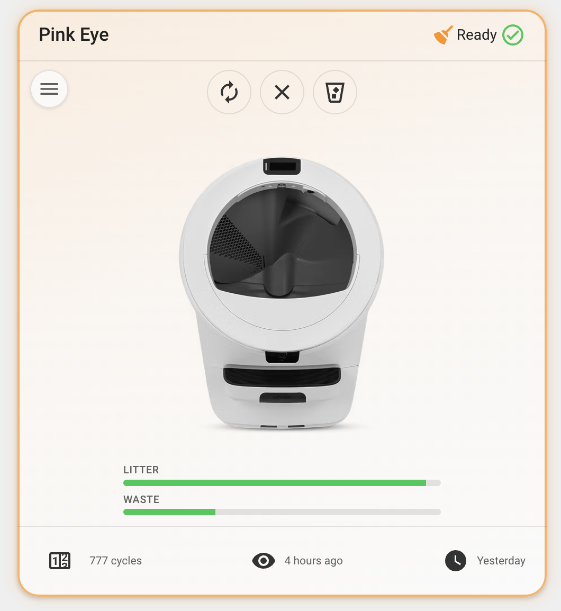
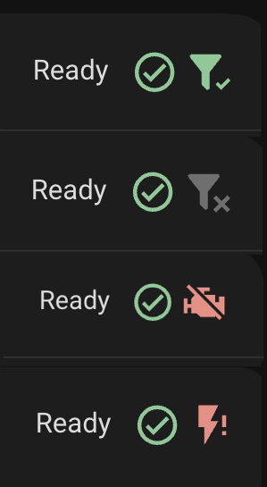
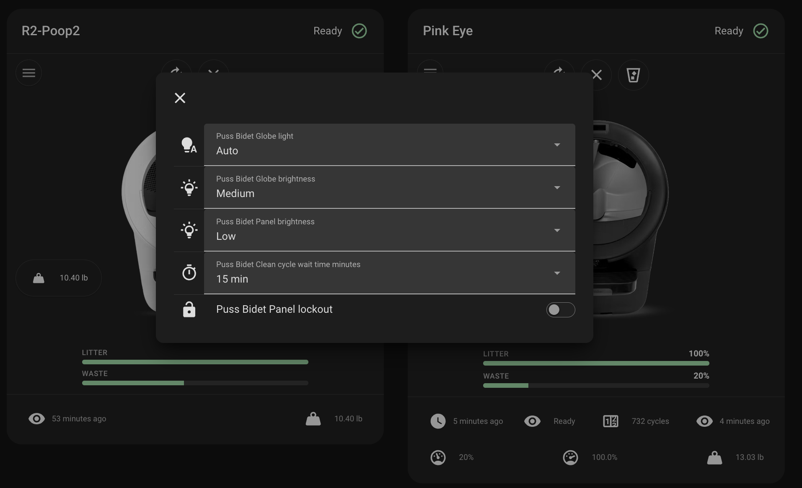

# Features

- **Model-aware artwork** — The card shows an image matching your robot, detected from the device's model and serial number (Litter-Robot 4, 5, 5 Pro, or Evo). A `color` option picks white or black artwork ([Configuration options](configuration/OPTIONS.md)).
- **Status header** — Friendly title (device name or optional override), human-readable status text, and a colored **status icon** derived from the `status_code` sensor.
- **Cycle styling** — While the robot reports an active cycle (`ccp`, `ec`, `cst`), the card reflects **cycling** state for subtle visual emphasis.
- **Quick actions** — Picture-style controls for the litter box **vacuum** and **reset** (see [Interactions](configuration/INTERACTIONS.md)).
- **Controls menu** — A menu button opens a dialog with standard Lovelace **entity rows** for globe light, globe brightness, panel brightness, cycle delay, and panel lockout when those entities exist.
- **Pet weight** — A compact chip for the **pet weight** sensor (when present). Optional `hide_pet_weight` feature flag hides the chip on the robot image while keeping the sensor available ([Feature flags](configuration/FEATURE-FLAGS.md)).
- **Pet weight graph** — A pet weight graph below the gauges. Choose between Home Assistant's native **history graph** (live data) or **statistics graph** (long-term mean/min/max trends) via `graph_type`. Per-cat weight sensors are auto-detected; use the `chonk` option to choose sensors, set the time window, statistic types, chart style (`line`, `line-stack`, `bar`, `bar-stack`), or hide the graph ([Pet weight graph](configuration/OPTIONS.md#pet-weight-graph)).
- **LitterHopper status** — On **Litter-Robot 4** with a **LitterHopper** attached, a **header badge** appears next to the robot status icon when the integration exposes hopper entities. You can also add **Hopper status** and **Hopper connected** to the footer ([Footer configuration](configuration/FOOTER.md)). Badge icons match the official [`litterrobot` integration](https://github.com/home-assistant/core/blob/dev/homeassistant/components/litterrobot/icons.json); colors follow your Home Assistant theme.
- **Cleaning reminder** — Point the card at any on/off-style entity with `cleaning_entity`; when it's active, a `mdi:broom` **header badge** and a warning-colored **card glow** (tinted background + border) appear, signalling the unit needs cleaning. Tap the badge for more-info. Great for a calendar-driven "needs cleaned" loop ([Cleaning reminder](configuration/CLEANING-REMINDER.md)).

### LitterHopper header badge

The badge combines `hopper_connected` and `hopper_status`. When the hopper is disconnected, that takes priority over status.

| Condition                                           | Icon                       | Badge color  |
| --------------------------------------------------- | -------------------------- | ------------ |
| Hopper disconnected (`hopper_connected` off)        | `mdi:filter-remove`        | Muted (gray) |
| Connected, ready (`hopper_status` **Enabled**)      | `mdi:filter-check`         | Green        |
| Connected, needs refill (`hopper_status` **Empty**) | `mdi:filter-minus-outline` | Orange       |
| Connected, disabled                                 | `mdi:filter-remove`        | Gray         |
| Motor disconnected                                  | `mdi:engine-off`           | Red          |
| Motor fault (short)                                 | `mdi:flash-off`            | Red          |
| Motor over-current                                  | `mdi:flash-alert`          | Red          |
| Status unknown or unavailable                       | `mdi:filter`               | Muted (gray) |

Tap the badge to open the hopper status more-info dialog (or the connected entity when status is missing).

- **Litter and waste gauges** — Visual fill levels; waste styling reflects severity as the drawer fills. Optionally show fill **percentages** on the gauge labels ([Feature flags](configuration/FEATURE-FLAGS.md)).
- **Customizable footer** — Choose which device metrics appear in the card footer ([Footer configuration](configuration/FOOTER.md)). Defaults to total cycles, status last changed, and last seen.

