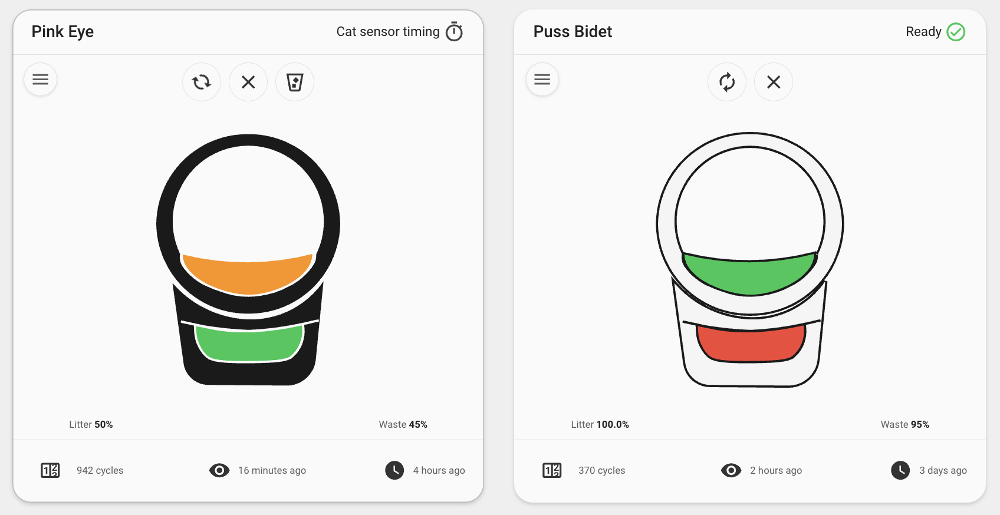

# Examples

## Minimal

```yaml
type: custom:whisker-card
device_id: YOUR_DEVICE_ID
```

## Custom title

```yaml
type: custom:whisker-card
device_id: YOUR_DEVICE_ID
title: Cat HQ
```

## Robot color

The model (Litter-Robot 4 / 5 / 5 Pro / Evo) is auto-detected; pick the color to match your unit (`white` is the default).

```yaml
type: custom:whisker-card
device_id: YOUR_DEVICE_ID
color: black
```

## Gauge percentages

```yaml
type: custom:whisker-card
device_id: YOUR_DEVICE_ID
features:
  - percentage
```

## Illustrated levels

Use the opt-in illustration (colored litter/waste zones) instead of the marketing image and thin bars:



```yaml
type: custom:whisker-card
device_id: YOUR_DEVICE_ID
features:
  - illustrated
  - percentage
```

## Mini layout


A compact card for wall-mount dashboards — name, status, and the two gauges.

```yaml
type: custom:whisker-card
device_id: YOUR_DEVICE_ID
mini: true
```

Mini pairs well with gauge percentages and a cleaning reminder:

```yaml
type: custom:whisker-card
device_id: YOUR_DEVICE_ID
mini: true
title: Upstairs
cleaning_entity: input_boolean.litter_robot_needs_cleaning
features:
  - percentage
```

## Pet weight history graph

Auto-detects per-cat weight sensors. List them explicitly to control which appear:

```yaml
type: custom:whisker-card
device_id: YOUR_DEVICE_ID
chonk:
  graph_type: history
  kitties:
    - sensor.tuna_weight
    - sensor.mittens_weight
  hours_to_show: 168
```

## Pet weight statistics graph

Plots long-term statistics (mean/min/max) — great for spotting trends over weeks or months. This is the default for new cards added through the dashboard UI:

```yaml
type: custom:whisker-card
device_id: YOUR_DEVICE_ID
chonk:
  graph_type: statistics
  days_to_show: 30
  period: day
  stat_types:
    - mean
    - max
    - min
  chart_type: line
```

Stacked line chart:

```yaml
type: custom:whisker-card
device_id: YOUR_DEVICE_ID
chonk:
  graph_type: statistics
  chart_type: line-stack
  stat_types:
    - mean
```

Hide the graph entirely:

```yaml
type: custom:whisker-card
device_id: YOUR_DEVICE_ID
chonk:
  hide: true
```

## Pet visits graph

Auto-detects the per-cat `visits_today` sensors and plots daily totals as bars — no configuration needed. To pick specific cats and a shorter window:

```yaml
type: custom:whisker-card
device_id: YOUR_DEVICE_ID
visits:
  kitties:
    - sensor.tuna_visits_today
    - sensor.mittens_visits_today
  days_to_show: 14
  chart_type: bar
```

Watch the last couple of days hour by hour with the history graph instead:

```yaml
type: custom:whisker-card
device_id: YOUR_DEVICE_ID
visits:
  graph_type: history
  hours_to_show: 48
```

Hide the visits graph entirely:

```yaml
type: custom:whisker-card
device_id: YOUR_DEVICE_ID
visits:
  hide: true
```

## Collapsible graphs

Keep both graphs on the card but start them closed, so the card stays compact:

```yaml
type: custom:whisker-card
device_id: YOUR_DEVICE_ID
chonk:
  collapsed: true
visits:
  collapsed: true
```

## Custom footer

Order matters:

```yaml
type: custom:whisker-card
device_id: YOUR_DEVICE_ID
footer:
  - total_cycles
  - status_changed
  - pet_weight
  - last_seen
```

## LitterHopper footer (LR4)

```yaml
type: custom:whisker-card
device_id: YOUR_DEVICE_ID
footer:
  - hopper_status
  - hopper_connected
```
