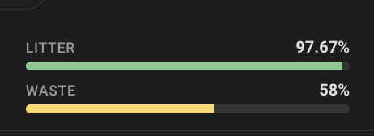

# Feature flags

## Gauge percentages

Show fill **percentages** on litter and waste gauge labels:



```yaml
type: custom:whisker-card
device_id: YOUR_DEVICE_ID
features:
  - percentage
```

> Looking for pet weight? Add `pet_weight` to the [footer](FOOTER.md), or use the pet weight **graph** (history or statistics) configured via the `chonk` option. See [Pet weight graph](OPTIONS.md#pet-weight-graph).
