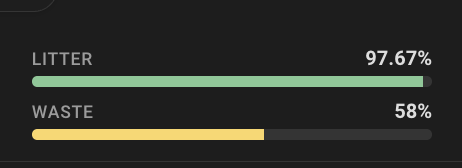

# Feature flags

## Gauge percentages

Show fill **percentages** on litter and waste gauge labels (and on the SVG level graphic when that feature is on):



```yaml
type: custom:whisker-card
device_id: YOUR_DEVICE_ID
features:
  - percentage
```

## Illustrated levels

Replace the marketing robot image and thin litter/waste bars with an opt-in illustration. Litter (globe bed) and waste (drawer panel) zones fill from the bottom in proportion to their level — a drawer at 90% draws nearly full — and color by level, green / yellow / red, while the rest of the robot stays neutral. Tap a zone to open that entity's more-info dialog.


```yaml
type: custom:whisker-card
device_id: YOUR_DEVICE_ID
features:
  - illustrated
  # optional:
  # - percentage
```

The illustration follows the `color` option, so it renders in black or white to match your artwork preference.

> Looking for pet weight? Add `pet_weight` to the [footer](FOOTER.md), or use the pet weight **graph** (history or statistics) configured via the `chonk` option. See [Pet weight graph](OPTIONS.md#pet-weight-graph).

> Looking for pet visits? That graph is configured via the `visits` option, not a feature flag. See [Pet visits graph](OPTIONS.md#pet-visits-graph).
