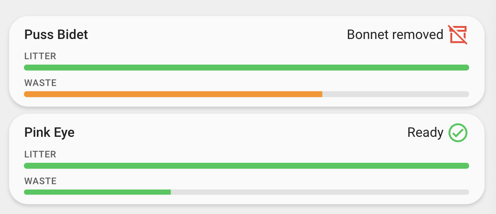
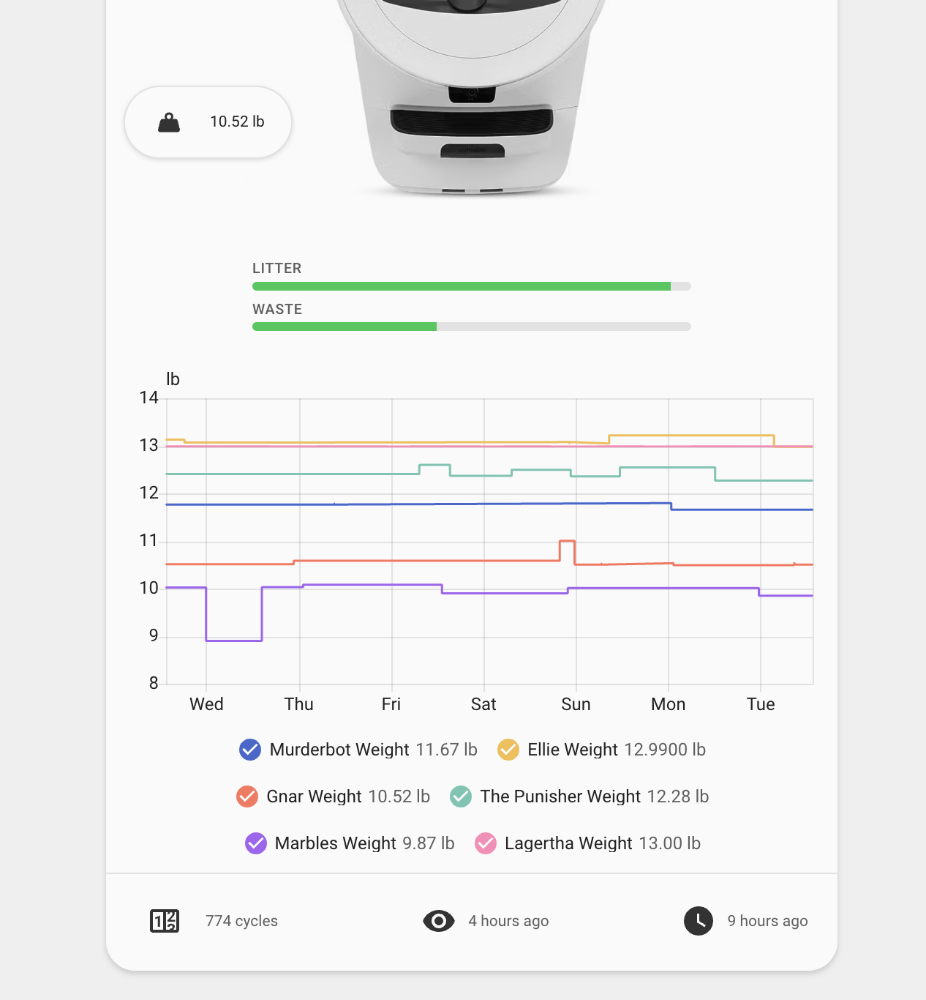
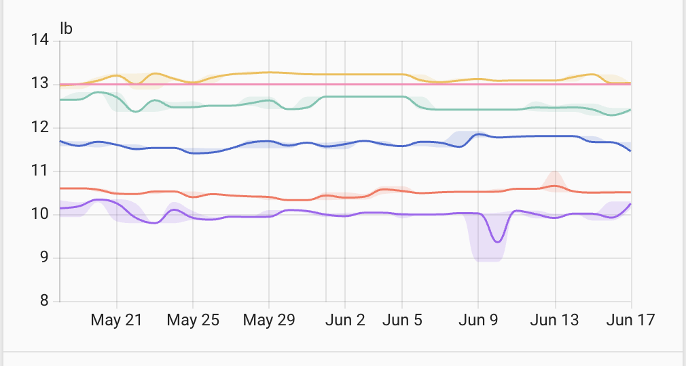
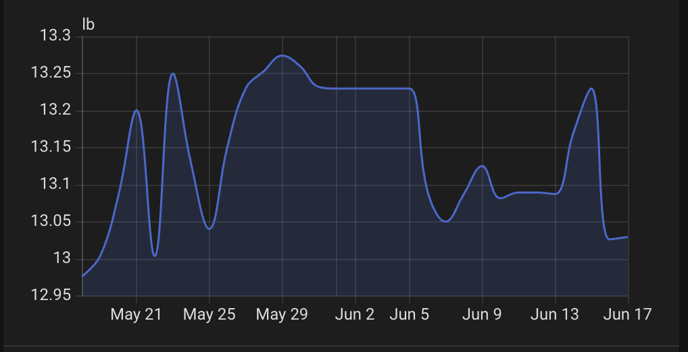

# Configuration options

| Option            | Type     | Description                                                                                                                                                                                                                        |
| ----------------- | -------- | ---------------------------------------------------------------------------------------------------------------------------------------------------------------------------------------------------------------------------------- |
| `device_id`       | string   | **Required.** Home Assistant device id for the Litter-Robot.                                                                                                                                                                       |
| `title`           | string   | Optional. Overrides the card heading; defaults to the device name.                                                                                                                                                                 |
| `cleaning_entity` | string   | Optional. Entity (`input_boolean`, `alert`, `binary_sensor`, or `switch`) whose active state shows a "needs cleaning" header badge + card glow. See [Cleaning reminder](CLEANING-REMINDER.md).                                     |
| `color`           | string   | Optional. Robot artwork color: `white` (default) or `black`.                                                                                                                                                                       |
| `mini`            | boolean  | Optional. Compact layout: title row and litter/waste gauges only. Hides the artwork, quick actions, controls menu, graphs, and footer. See [Mini layout](#mini-layout) below.                                                      |
| `footer`          | string[] | Optional. Footer metrics in display order. See [footer items](#footer-items) below.                                                                                                                                                |
| `features`        | string[] | Optional. Feature flags. `percentage` — show fill % on litter and waste gauges. `illustrated` — robot illustration with colored litter/waste zones instead of the marketing image and bars. See [Feature flags](FEATURE-FLAGS.md). |
| `chonk`           | object   | Optional. Pet weight graph options (history or statistics graph). See [Pet weight graph](#pet-weight-graph) below.                                                                                                                 |
| `visits`          | object   | Optional. Pet visits graph options (daily litter box visits per cat). See [Pet visits graph](#pet-visits-graph) below.                                                                                                             |

### Mini layout



Set `mini: true` for a compact, low-profile card built for wall-mount and small dashboards:

```yaml
type: custom:whisker-card
device_id: YOUR_DEVICE_ID
mini: true
```

The mini card keeps the **title row** — device name, status text and icon, plus the [cleaning](CLEANING-REMINDER.md) and LitterHopper badges when configured — and the **litter and waste gauges**, which stretch to the full card width.

Omitted in mini: the robot artwork, quick actions, controls menu, both pet graphs, and the footer. Because those do nothing here, the visual editor hides their options while `mini` is on.

Still supported in mini: `title`, `cleaning_entity`, and the `percentage` / `illustrated` [feature flags](FEATURE-FLAGS.md). The cycling and needs-cleaning card glows work as usual.

### Footer items

Values for `footer`:

- `total_cycles`
- `status_changed`
- `last_seen`
- `pet_weight`
- `status`
- `litter_level`
- `waste_drawer`
- `hopper_status`
- `hopper_connected`

`hopper_status` and `hopper_connected` apply only on **LR4** with a **LitterHopper** attached.

More detail in [Footer configuration](FOOTER.md).

### Pet weight graph

The card shows a pet weight graph below the gauges. It can render either Home Assistant's built-in **history graph** (live recorder data) or its **statistics graph** (long-term statistics — mean/min/max aggregated over days). Pick the mode with `graph_type`. When it is omitted, the card uses the **statistics graph** (mean/min/max, daily) — both from the dashboard UI and from hand-written YAML.

Configure it with the `chonk` object:

| Key             | Type     | Graph      | Description                                                                                                                  |
| --------------- | -------- | ---------- | ---------------------------------------------------------------------------------------------------------------------------- |
| `kitties`       | string[] | both       | Optional. Weight sensor entity ids to plot. When omitted, the card auto-detects per-cat weight sensors from the integration. |
| `graph_type`    | string   | both       | Optional. `statistics` (default) or `history`.                                                                               |
| `hide`          | boolean  | both       | Optional. Hide the weight graph entirely. Defaults to `false`.                                                               |
| `collapsed`     | boolean  | both       | Optional. Start the titled collapsible section closed. Defaults to `false` (starts open).                                    |
| `hide_names`    | boolean  | both       | Optional. History graph: hide entity names. Statistics graph: hide the legend. Defaults to `false`.                          |
| `hours_to_show` | number   | history    | Optional. Hours of history to show. Defaults to `168` (7 days).                                                              |
| `days_to_show`  | number   | statistics | Optional. Days of statistics to show. Defaults to `30`.                                                                      |
| `period`        | string   | statistics | Optional. Aggregation period: `auto` (default), `5minute`, `hour`, `day`, `week`, or `month`.                                |
| `stat_types`    | string[] | statistics | Optional. Statistic series to plot: `mean` (default), `min`, `max`, `state`, `change`, `sum`.                                |
| `chart_type`    | string   | statistics | Optional. Chart style: `line` (default), `line-stack`, `bar`, or `bar-stack`.                                                |

#### History graph



```yaml
type: custom:whisker-card
device_id: YOUR_DEVICE_ID
chonk:
  graph_type: history
  kitties:
    - sensor.kitty_weight
    - sensor.mittens_weight
  hours_to_show: 168
```

#### Statistics graph

Plots long-term statistics, which is ideal for spotting weight trends over weeks or months.



```yaml
type: custom:whisker-card
device_id: YOUR_DEVICE_ID
chonk:
  graph_type: statistics
  kitties:
    - sensor.kitty_weight
    - sensor.mittens_weight
  days_to_show: 30
  period: day
  stat_types:
    - mean
    - max
    - min
  chart_type: line
```

Use a stacked chart (`line-stack` or `bar-stack`) to compare combined weight across cats:



```yaml
type: custom:whisker-card
device_id: YOUR_DEVICE_ID
chonk:
  graph_type: statistics
  chart_type: line-stack
  stat_types:
    - mean
```

### Pet visits graph

The card also shows a **visits** graph below the weight graph, plotting how many times each cat used the box. It's built from the integration's per-pet `visits_today` sensors, which are auto-detected the same way weight sensors are.

That sensor is a running daily total that resets at midnight, so the defaults differ from the weight graph: a **statistics graph** plotting **`change`** (visits per period) as **stacked bars** over a **daily** period. Stacking gives you one bar per day showing the household's total visits, split by cat. Averages and min/max don't mean anything for a resetting counter, so the editor only offers `change` and `sum`.

Configure it with the `visits` object:

| Key             | Type     | Graph      | Description                                                                                                        |
| --------------- | -------- | ---------- | ------------------------------------------------------------------------------------------------------------------ |
| `kitties`       | string[] | both       | Optional. `visits_today` sensor entity ids to plot. When omitted, the card auto-detects them from the integration. |
| `graph_type`    | string   | both       | Optional. `statistics` (default) or `history`.                                                                     |
| `hide`          | boolean  | both       | Optional. Hide the visits graph entirely. Defaults to `false`.                                                     |
| `collapsed`     | boolean  | both       | Optional. Start the titled collapsible section closed. Defaults to `false` (starts open).                          |
| `hide_names`    | boolean  | both       | Optional. History graph: hide entity names. Statistics graph: hide the legend. Defaults to `false`.                |
| `hours_to_show` | number   | history    | Optional. Hours of history to show. Defaults to `168` (7 days).                                                    |
| `days_to_show`  | number   | statistics | Optional. Days of statistics to show. Defaults to `30`.                                                            |
| `period`        | string   | statistics | Optional. Aggregation period: `day` (default), `auto`, `5minute`, `hour`, `week`, or `month`.                      |
| `stat_types`    | string[] | statistics | Optional. Statistic series to plot: `change` (default) or `sum`.                                                   |
| `chart_type`    | string   | statistics | Optional. Chart style: `bar-stack` (default), `bar`, `line`, or `line-stack`.                                      |

Nothing is required — with the integration set up, the graph appears on its own:

```yaml
type: custom:whisker-card
device_id: YOUR_DEVICE_ID
```

Pick specific cats and a shorter window:

```yaml
type: custom:whisker-card
device_id: YOUR_DEVICE_ID
visits:
  kitties:
    - sensor.ellie_visits_today
    - sensor.mittens_visits_today
  days_to_show: 14
  chart_type: bar
```

Use plain `bar` (as above) to give each cat its own bar instead of stacking them.

Hide it entirely:

```yaml
type: custom:whisker-card
device_id: YOUR_DEVICE_ID
visits:
  hide: true
```

#### Collapsible sections

Each graph sits in its own titled section ("Pet weight", "Pet visits") that you can click to open and close. Set `collapsed: true` to have a section start closed — useful when you want a graph available without making the card tall:

```yaml
type: custom:whisker-card
device_id: YOUR_DEVICE_ID
chonk:
  collapsed: true
visits:
  collapsed: true
```

Expanding a section lasts for as long as the dashboard stays loaded; it returns to closed on the next refresh. Use `hide` instead of `collapsed` if you never want the graph shown at all.
