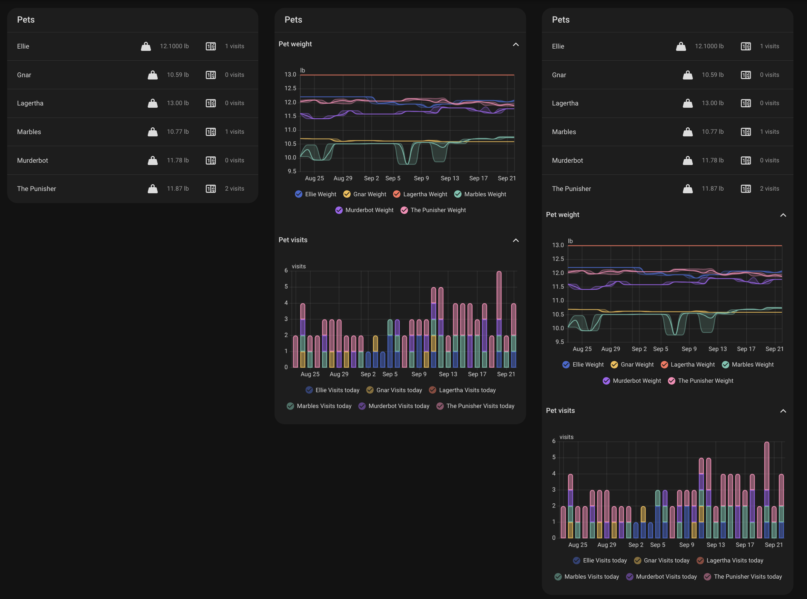

# Pet card

`whisker-pet-card` is a separate card for your cats. The Litter-Robot integration reports weight and visits for each pet, so with more than one Litter-Robot every robot card repeats the same cat data. The pet card shows it once.

```yaml
type: custom:whisker-pet-card
```

That's the whole config. The card picks up every pet the integration reports and lists each cat's current weight and visits today. Tap a value to open its more-info dialog.

The screenshot shows the three `display` values, left to right: `states`, `graphs`, and `both`.



## Options

| Option    | Type     | Description                                                                                                                                          |
| --------- | -------- | ---------------------------------------------------------------------------------------------------------------------------------------------------- |
| `title`   | string   | Optional. Card heading. Defaults to "Cats".                                                                                                          |
| `pets`    | string[] | Optional. Home Assistant **device** ids of the pets to show. The visual editor lists them by name. When omitted, the card shows every pet.           |
| `display` | string   | Optional. `states` (default) lists each pet's current values, `graphs` shows the weight and visits graphs, and `both` shows the list first.          |
| `chonk`   | object   | Optional. Pet weight graph options, the same as the robot card's [`chonk`](OPTIONS.md#pet-weight-graph). Used when `display` is `graphs` or `both`.  |
| `visits`  | object   | Optional. Pet visits graph options, the same as the robot card's [`visits`](OPTIONS.md#pet-visits-graph). Used when `display` is `graphs` or `both`. |

The card names each pet after its device. Rename the device in Home Assistant and the card shows the new name.

## Examples

### States and graphs together

```yaml
type: custom:whisker-pet-card
title: The Cats
display: both
```

### One cat, graphs only

Pick the pet in the visual editor, or paste its device id:

```yaml
type: custom:whisker-pet-card
title: Ziggy
pets:
  - 1a2b3c4d5e6f7a8b9c0d1e2f3a4b5c6d
display: graphs
```

### 60 days of mean weight, visits collapsed

```yaml
type: custom:whisker-pet-card
display: both
chonk:
  graph_type: statistics
  days_to_show: 60
  stat_types:
    - mean
visits:
  collapsed: true
```

## Using it with the robot card

The robot card still shows both graphs. To show the cat data only on the pet card, hide the graphs on each robot card:

```yaml
type: custom:whisker-card
device_id: YOUR_DEVICE_ID
chonk:
  hide: true
visits:
  hide: true
```

Both cards read the same [`litterrobot` integration](https://www.home-assistant.io/integrations/litterrobot/) entities, so there's nothing else to set up.
