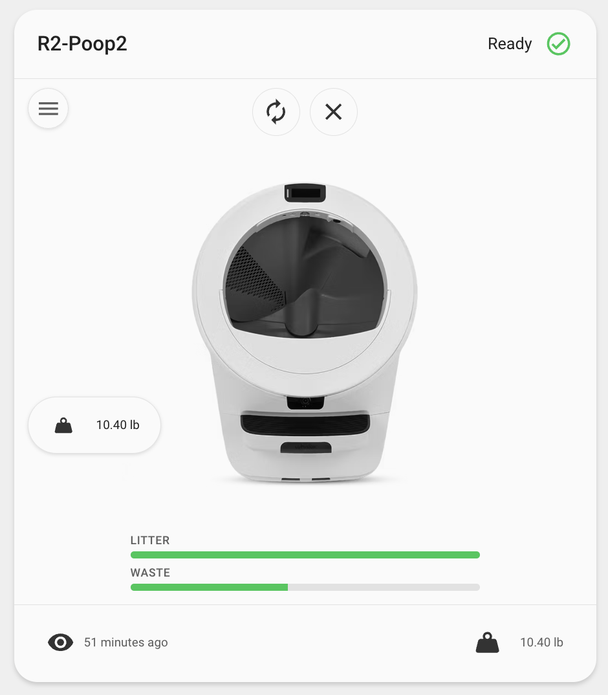
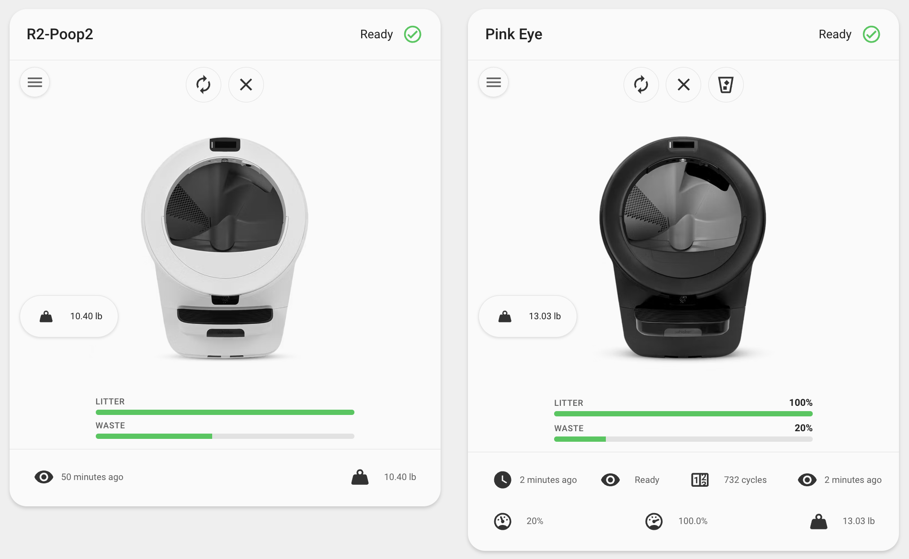

<p align="center">
  
</p>

# Whisker Card

Litter-Robot status and controls in a single Lovelace card.

## Overview

Whisker Card is a custom Lovelace card for Home Assistant that shows your **Litter-Robot** at a glance. It uses the official **[Litter-Robot integration](https://www.home-assistant.io/integrations/litterrobot/)** (`litterrobot`).



## Quick start

```yaml
type: custom:whisker-card
device_id: YOUR_DEVICE_ID
```

Replace `YOUR_DEVICE_ID` with the id from the device page in Home Assistant, or use the UI editor to pick the device.

## What you get

- Model-aware robot artwork (auto-detected) with a white/black color option
- Status header with human-readable status and colored icon
- Quick actions (vacuum / reset / waste drawer when available)
- Controls menu with native entity rows
- Pet weight chip and litter / waste gauges
- Pet weight history graph (auto-detects multiple cats)
- **LitterHopper status badge** on LR4 when a LitterHopper is attached (optional hopper footer items too)
- Optional gauge percentages and customizable footer

## Next steps

- [Installation](INSTALLATION.md)
- [Features](FEATURES.md)
- [Configuration](CONFIGURATION.md)
- [Troubleshooting](TROUBLESHOOTING.md)
